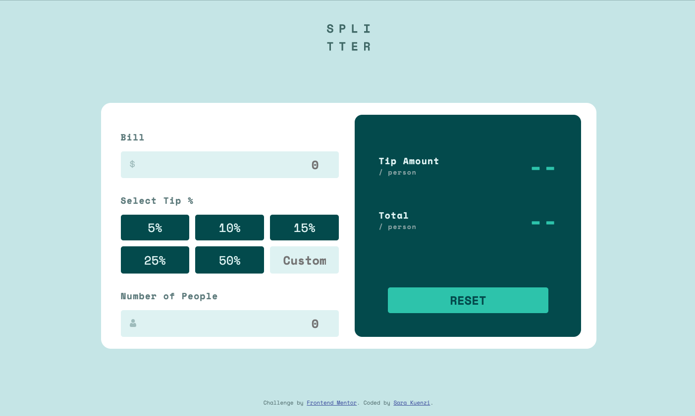
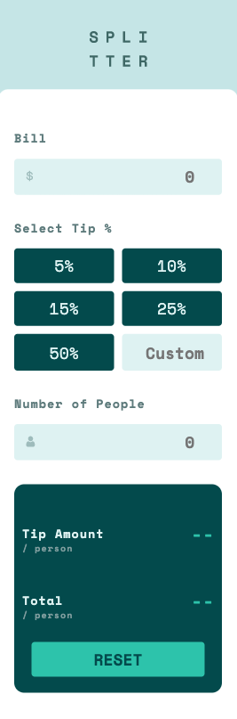

# Frontend Mentor - Tip calculator app solution

This is a solution to the [Tip calculator app challenge on Frontend Mentor](https://www.frontendmentor.io/challenges/tip-calculator-app-ugJNGbJUX). Frontend Mentor challenges help you improve your coding skills by building realistic projects.

## Table of contents

- [Overview](#overview)
  - [The challenge](#the-challenge)
  - [Screenshot](#screenshot)
  - [Links](#links)
- [My process](#my-process)
  - [Built with](#built-with)
  - [What I learned](#what-i-learned)
  - [Continued development](#continued-development)
  - [Useful resources](#useful-resources)
- [Author](#author)


## Overview

### The challenge

Users should be able to:

- View the optimal layout for the app depending on their device's screen size
- See hover states for all interactive elements on the page
- Calculate the correct tip and total cost of the bill per person

### Screenshot




### Links

- Solution URL: (https://github.com/skuenzi/tip-calculator)
- Live Site URL: (https://skuenzi.github.io/tip-calculator/)

## My process

### Built with

- Semantic HTML5 markup
- CSS custom properties
- Flexbox
- CSS Grid
- Mobile-first workflow


### What I learned

This project reminded me of a few Vanilla JS issues that I haven't worked with in a while. First was the data types issue. When a few of my calculations weren't working, I had to rewind and debug step by step until I found out that some of the inputs were returning strings rather than numbers. I was then able to find the bugs and fix them with a few simple native methods. The step-by-step logic was another minor challenge. It took a bit of mental exercise to think about each step of the calculations, when to perform those calculations, and prevent NaN returning as the solution. I got a lot of practice with conditionals. 

```js
function getValue (e) {
    if (e.target === billInput) {
        bill = parseFloat(billInput.value)
    } else if (e.target === peopleInput) {
        people = parseInt(peopleInput.value, 10)
    } else if (e.target === custTipInput) {
        custTip = custTipInput.value
    }
}
```

### Continued development

This project gave me several ideas for refactoring and more efficient code. I definitely need to become more comfortable with switch statements and ternaries to do away with some of the blocky if-statements. 
### Useful resources

- [MDN](https://developer.mozilla.org/en-US/) - Gotta love MDN and their excellent explanations. Just two examples of how I used MDN were understanding how to iterate over a HTMLCollection and dealing with rounding and turning strings into numbers.
## Author

- Website - [Sara Kuenzi](https://skuenzi.github.io)
- Frontend Mentor - [@skuenzi](https://www.frontendmentor.io/profile/skuenzi)
- Github - [skuenzi](https://github.com/skuenzi)


